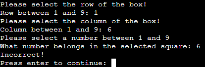

# **Car Quiz**

You can see the live website [here](https://browne878-sudoku-cli.herokuapp.com/).

The purpose of this website is to give the player a fun game that is easy play.

My aim for the Sudoku game is to provide an easy to use interface which makes it easy to play. I also want the players to be able to select a difficulty they want to play or randomise it for a challenge.

## **Table of Contents**

- ### [Planning]()

- ### [UI/UX Decisions]()

- ### [Features]()

- ### [Future Development]()

- ### [Testing]()

- ### [Bugs]()
    - [Unfixed Bugs]()
    - [Fixed Bugs]()

- ### [Deployment]()
    - [Cloning/Forking Repository]()
    - [Local Deployment]()
    - [Remote Deployment]()

- ### [Credits]()

## **Planning**


I started my planning by coming up with 2 ideas. These were hangman and sudoku. I the proceeded to plan the flow of each using Lucidchart. This allowed me to get an idea about how I would develop each idea.

After reviewing my plans, I decided to make this project a sudoku game. I decided this because I wanted to make a challenging game which people can play multiple times.

## **UI/UX Decisions**

## **Features**

### **Instructions**
- During development, I decided to give the user the option to view the instructions or not. I decided to do this as many people already know the rule of Sudoku. This means it will be a lot easier for those who already know how to play. It also gives people who do not know how to play the option to read the instruction and learn how to play the game.


### **Difficulty**
- I also added the option to choose a difficult. This allows players with differing levels of experience to enjoy the game. I also added in a random option to allow the user to challenge themselves.


### **Score Header**
- I decided to add a score header to allow the player to keep track of correct and incorrect guesses. This allows the user to challenge themselves to do better each time.


### **Board**
- I added a visual board to allow the player to see where their guesses need to go. It also makes it easier to play the game and makes it a lot more fun. Without being able to visualize the board, it would be a lot harder to play.


### **Guess Input**
- I decided that the best way to take the user input would be to request the row, column and guess separately. This makes it simple for the user to select the square and input their guess.


### **Result**
- I also decided to tell the user whether they got it right or not. This makes it easy for the user to tell if they got it right or wrong and waits for their input before continuing.


### **Clearing the Terminal**
- After each guess process, I decided to clear the terminal. This prevents making the player scroll up and down the console. It makes it much more readable and easy to use.

## **Future Development**

- In the future, I would like to connect the game to a database via an API. There, I could store the high scores of each game and board. I would also include a command to allow the player to view the high scores for each board before and after each game.

- I would also like to add more sudoku boards to the JSON to allow more of a variety of boards with each difficulty.

## **Testing**

In order to keep the documentation organised and easy to read, I have moved the testing into a seperate file. This file can be found [here](./assets/readme/testing/TESTS.md)

## **Bugs**

### Unfixed Bugs

There are no known bugs at this time.

### Fixed Bugs
- After making changes to the board array to center it within the console, I was no longer able to select the required box. It would always say my answer was incorrect. This is due to the column array within the board class. The index's were no longer correct after changing the board array. After correcting this, the bug was resolved.

- When I decided to center the board, at first, I only changed the empty board within the Board class. This resulted in, the board not being centered within the console due it being changed when the board was loaded. To resolve this, I applied the same changes to each board within the JSON file. This resolved the issue.

## **Deployment**

### Cloning / Forking Repository

In order to Fork the Repository, please follow the instructions below.
 1. Navigage to [this](https://github.com/browne878/Sudoku-CLI) repository.
 2. Next, in the top left of the page, click the fork button.
 3. If you are a member of a team, you may need to choose where to Fork the repository too.

Once you have forked the Repository, you can then clone it to your local machine. To do so, please follow the instructions below.
 1. Navigate to your Forked repository.
 2. Click the green Code button above the repositories files.
 3. Copy the URL in the dropdown window.
 4. Next, open command prompt.
 5. After this, navigate to the directory you would like to clone the repository too with the following command.
 ```
cd <clone location>
 ```
 6. Then, run the following command.
 ```
git clone <URL>
 ```

You have now forked and cloned the repository.

### Local Deployment

These instructions will tell you how to deploy the repository on your local machine with VSCode and the extension [Live Server](https://marketplace.visualstudio.com/items?itemName=ritwickdey.LiveServer). Please ensure you have VSCode and the Live Server extension installed before beginning the following steps.

1. First, follow the steps for Cloning and Forking the repository so you have the repository locally.
2. Open the folder with VSCode by doing one of the following:
    - Right click the file and click `Open with Code`
    - Open command prompt, navigate inside the directiory and run the command `code .`
    - Open VSCode, click file, open folder and then navigate to the repository folder and open it.
3. Next, at the very bottom of the window, there will be a button that says `Go Live`. Click this button and it will deploy it locally and open it in your default browser for you to view.

### Remote Deployment

The following instructions will guide you the deployment process for Heroku. I will assume you already have a [Heroku](https://www.heroku.com/) account.
1. First, follow the instructions to clone the repository to your GitHub.
2. On Heroku, login and navigate to your dashboard.
3. In the top right, click `New` and select `Create a new app`.
4. Next, name your app and select your region and click `Create app`.
5. After this, under the deployment method, select GitHub and link your account with GitHub.
6. Then, search for your cloned repository and click `Connect`.
7. Under the `Automatic deploys` section, ensure the main branch is selected and click the `Enable Automatic Deploys`.
8. Also, under the main branch is selected in the `Manual deploy` section.
9. Next, at the top of the page, navigate to the settings page.
10. After this, under the `Config Vars` section, click the `Reveal Config Vars` button and enter the following `KEY` : `PORT` - `VALUE` : `8000`.
11. Then, in the section below (`Buildpacks`), click `Add buildpack` and select python.
12. Repeat the previous step, but this time, select NodeJS.
13. Once this is done, ensure that the python buildpack is at the top of the list. (You can drag them to move them).
14. Then, at the top of the page, navigate back to the deploy section.
15. Finally, you can scroll to the bottom of the page and click the `Deploy Branch` button under the `Manual deploy` section.
16. Once the deployment is complete, you can click the `Open app` button at the top right of the page. This will open the deployed app in a new tab.

## **Credits**

Code to clear the terminal after each guess was sourced from [Stack Overflow](https://stackoverflow.com/questions/2084508/clear-terminal-in-python)
