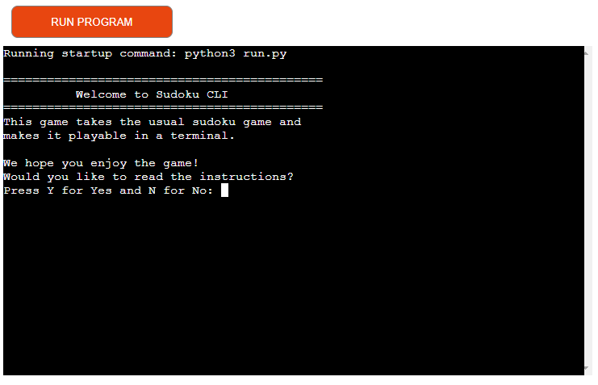
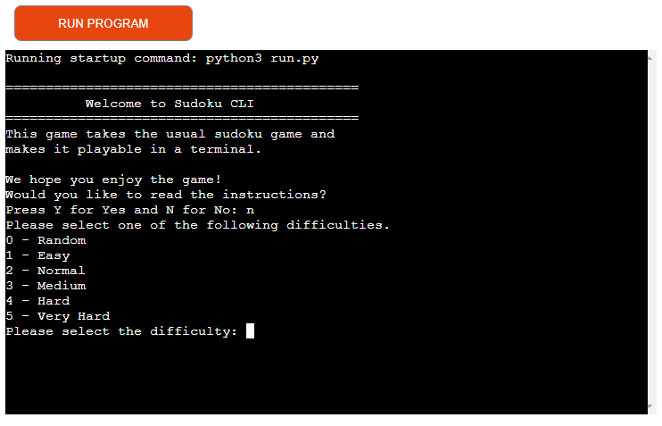
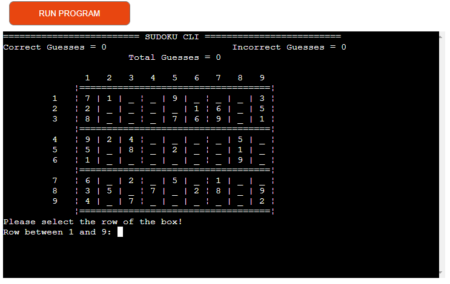
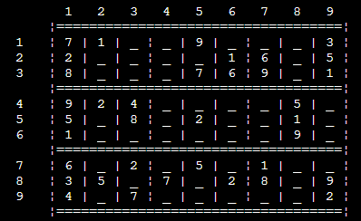
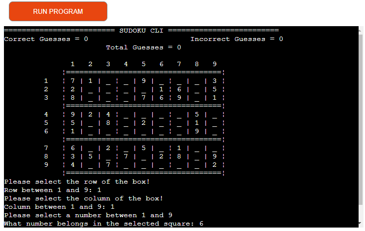

# **Car Quiz**


You can see the live website [here]().

The purpose of this website to provide the user with a fun and challenging game to test their knowledge of cars.

My aim for this quiz was to make a simple and easy to use UI that allows the user to focus on the game. I wanted to be able to randomise the questions so the user can play multiple times. Finally, I wanted this website to be responsive, so that users on all devices can enjoy the completed website.

## **Table of Contents**

- ### [Planning]()

- ### [UI/UX Decisions]()

- ### [Features]()

- ### [Future Development]()

- ### [Testing]()

- ### [Bugs]()
    - [Unfixed Bugs]()
    - [Fixed Bugs]()

- ### [Deployment]()
    - [Cloning/Forking Repository]()
    - [Local Deployment]()
    - [Remote Deployment]()

- ### [Credits]()

## **Planning**


I started my planning by coming up with 2 ideas. These were hangman and sudoku. I the proceded to plan the flow of each using Lucidchart. This allowed me to get an idea about how I would develop each idea.

After reviewing my plans, I decided to make this project a sudoku game. I decided this because I wanted to make a challenging game which people can play multiple times.
## **UI/UX Decisions**

## **Features**

### **Instructions**
    During development, I deccided to give the user the option to view the instructions or not. I decided to do this as many poeple already know the rule of Sudoku. This means it will be alot easier for those who already know how to play. It also gives people who do not know how to play the option to read the instruction and learn how to play the game.


### **Difficulty**
    I also added the option to chose a difficulty. This allows players with differing levels of experience to enjoy the game. I also added in a random option to allow the user to challenge themselves.


### **Score Header**
    I decided to add a score header to allow the player to keep track of correct and incorrect guesses. This allows the user to challange themselves to do better each time.


### **Board***
    I added a visual board to allow the player to see where their guesses need to go. It also makes it easier to play the game and makes it a lot more fun.


### **Guess Input**
    I decided that the best way to take the users input would be to request the row, column and guess seperatly. This makes it simple for the user to select the square and input their guess.


## **Future Development**

## **Testing**

## **Bugs**

### Unfixed Bugs

### Fixed Bugs

## **Deployment**

### Cloning / Forking Repository

In order to Fork the Repository, please follow the instructions below.
 1. Navigage to [this](https://github.com/browne878/Sudoku-CLI) repository.
 2. Next, in the top left of the page, click the fork button.
 3. If you are a member of a team, you may need to choose where to Fork the repository too.

Once you have forked the Repository, you can then clone it to your local machine. To do so, please follow the instructions below.
 1. Navigate to your Forked repository.
 2. Click the green Code button above the repositories files.
 3. Copy the URL in the dropdown window.
 4. Next, open command prompt.
 5. After this, navigate to the directory you would like to clone the repository too with the following command.
 ```
cd <clone location>
 ```
 6. Then, run the following command.
 ```
git clone <URL>
 ```

You have now forked and cloned the repository.

### Local Deployment

These instructions will tell you how to deploy the repository on your local machine with VSCode and the extension [Live Server](https://marketplace.visualstudio.com/items?itemName=ritwickdey.LiveServer). Please ensure you have VSCode and the Live Server extension installed before beginning the following steps.

1. First, follow the steps for Cloning and Forking the repository so you have the repository locally.
2. Open the folder with VSCode by doing one of the following:
    - Right click the file and click `Open with Code`
    - Open command prompt, navigate inside the directiory and run the command `code .`
    - Open VSCode, click file, open folder and then navigate to the repository folder and open it.
3. Next, at the very bottom of the window, there will be a button that says `Go Live`. Click this button and it will deploy it locally and open it in your default browser for you to view.

### Remote Deployment

## **Credits**
