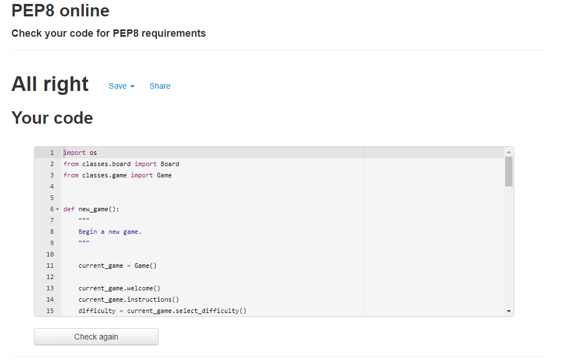
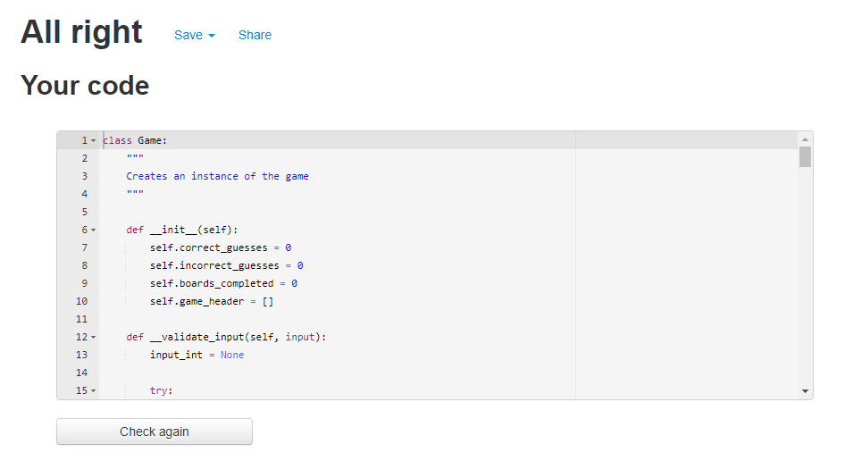
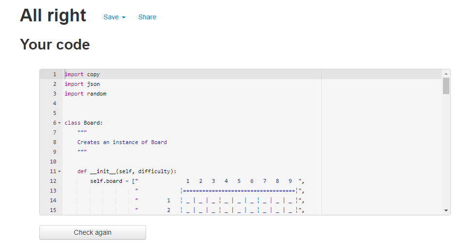
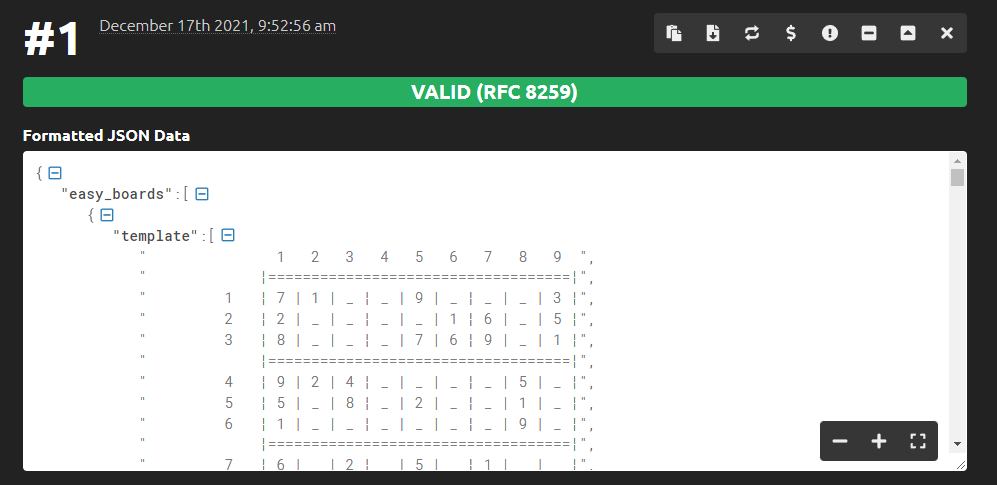

# **Contents**

- ## [Tests]()
    - 

# **Tests**

## **Read Instructions**

### Valid Inputs
- If the user wishes to read the instructions, the following inputs will be accepted (Y, N, y, n). The screenshots of my testing for valid inputs can be found [here](./images/valid-input/instructions).

### Invalid Inputs
- Anything other than valid input will not be accepted. This is due to the game checking for the exact valid inputs. I have tested all invalid inputs and they can be found [here](./images/invalid-input/instructions).

## **Select Difficulty**

### Valid Inputs
- To select a difficulty, the user must enter the number corresponding to the difficulty. Only the following inputs will be accepted (0, 1, 2, 3, 4, 5). The screenshots of testing these can be found [here](./images/valid-input/difficulty).

The screenshots for these tests have been done within the terminal of my code editor. This is due to the console being cleared after selecting a difficulty. In order to show the tests, I temporarily disabled this feature.

### Invalid Inputs
- To ensure a valid input, the user's input is checked to ensure that it is a number. After this, it is then checked to ensure that it is equal or greater than 0 and less than 6. Screenshots of my testing can be found [here](./images/invalid-input/difficulty).

## **Select Row, Column and Guess**

### Valid Inputs
- To select a row, the user must enter a number between 1 and 9. These are the only accepted input's. The testing of this can be found [here](./images/valid-input/row).

### Invalid Inputs
- To ensure that the user enters a valid input, the input is converted to a number. If that is successful, it ensures that the number is greater than 0 and less than 10. The testing to show this can be found [here](./images/invalid-input/row).

The reason I am able to combine these three in testing is due to them sharing the same validation function. This was implemented to prevent code repetition.

## **New Game**

### Valid Inputs
- At the end of each game, the user is given the option of being a new game. The only valid input's are Y, y, n and N. This is done by capitalizing the string from the input and then checking if it matches 'Y' or 'N'. The tests that show this can be found [here](./images/valid-input/new-game).

### Invalid Inputs
- Any input, other than one of the valid input's listed above, will not be accepted by the game. The testing of this can be found [here](./images/invalid-input/new-game).

These tests were done within the VSCode terminal. This was to prevent having to play through the entire game before testing the new game input. All changes were reverted back to the original after testing.

During this testing I found that there was no message provided if a valid input was not provided. I corrected this by adding a message if an invalid input is not provided before looping through again.

## **PEP8 Validation**

I put all of my python code through the [PEP8](http://pep8online.com/) validation. All of my code passed without any issues.

### run.py

### game.py

### board.py

## **JSON Validation**

I put the boards.json file through the [JSON Formatter and Validator](https://jsonformatter.curiousconcept.com/#). My JSON file passed with no issues.

